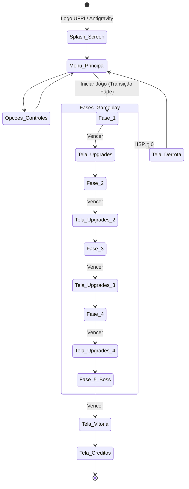

# Imunidade — Documento de Design de Jogo (GDD v2.0)
## Documento 4: Economia, UX e UI

---

### 1. Economia e Pontuação

A economia do jogo não usa moedas tradicionais. Tudo é medido pelo quão bem o jogador manipula o sistema de Polaridades para não tomar dano.

* **Score (Pontuação):** Aumenta ao matar inimigos e completar fases. Usado estritamente para o Ranking S-D no final de cada nível.
* **Cadeia de DNA (Tokens de Upgrade):** Derrotar certos inimigos críticos ("Bactérias Artilheiras" e Bosses) dropa fragmentos de DNA. Esses fragmentos são a moeda para Upgrades Passivos.
* **Combos (Multiplicador de Absorção):** Absorver disparos consecutivamente com a polaridade CORRETA (sem errar e tomar dano) aumenta o multiplicador do combo na tela (1x, 2x... 10x). Tomar dano reseta para 1x instantaneamente.

#### Tabela de Upgrades (Árvore de DNA)
Entre as fases, o jogador acessa o Menu de Melhorias (Baseado no sistema de UI do *Paint-em-OpenGL*, com botões clicáveis 2D).
1. **Membrana Reforçada (15 DNA):** Aumenta o cap de HSP de 100 para 130.
2. **Capacitador Surge (25 DNA):** Reduz o custo para ativar a habilidade especial em 20%.
3. **Conversor Cinético (40 DNA):** Reduz o cooldown do Dash (Evasão).

---

### 2. HUD e Interface do Usuário (UI)

O HUD será projetado em uma camada 2D por cima do mundo 3D usando `glOrtho` (como visto nos exemplos do P2). A renderização de texto fará uso da biblioteca `glut_text.h` recuperada dos arquivos da disciplina.

#### Layout da Tela In-Game
* **Canto Superior Esquerdo:** Barra de HSP (Vida). Desenhada como um retângulo preenchido verde/amarelo/vermelho. Texto em bitmap: `HSP: 100%`.
* **Centro Superior:** Timer de Combate e multiplicador atual de Combo (com animação de escala palpitante `glScalef` toda vez que o combo sobe).
* **Canto Inferior Direito:** Barra de SURGE (Habilidade especial). Fica piscando (intercalando Alpha com `GL_BLEND`) quando pronta para uso. Cor da interface reflete a Polaridade ativa (UI Azul ou UI Vermelha).

#### Feedback Visual Ativo
* Sempre que o escudo absorve algo: Pop-up de texto `+10 SURGE` subindo do personagem.
* Quando leva dano: Borda vermelha forte renderizada ao redor de toda a tela usando linhas de OpenGL (`GL_LINE_LOOP` grosso).

---

### 3. Fluxo de Telas (UX)

O jogo usará a máquina de estados (variável `TelaEstado`) para gerenciar as telas sem carregar cenas desnecessariamente.

**Botões do Menu:** Os botões não serão apenas imagens estáticas como na versão anterior. Usaremos hit-testing exato (Bounding Box 2D) com mouse, alterando a cor de fundo do botão (`glColor3f`) no hover, utilizando as estruturas do `Trabalho-02-Paint`.
