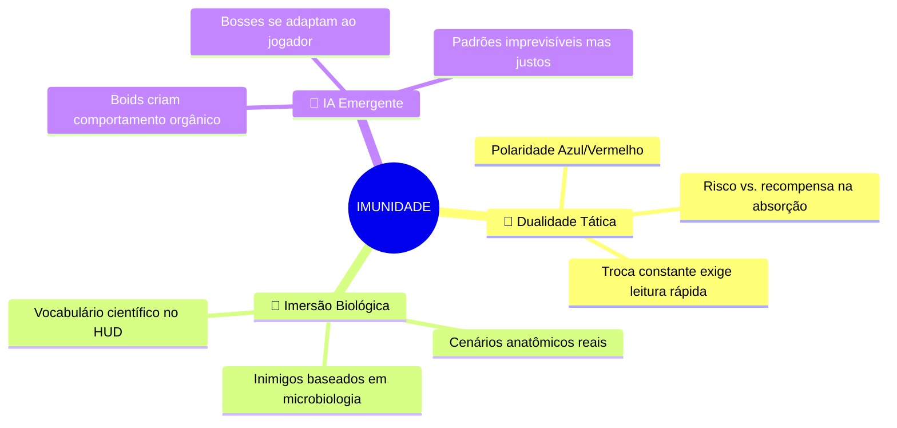
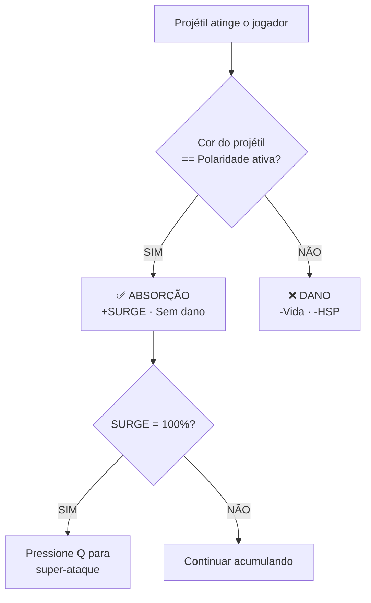
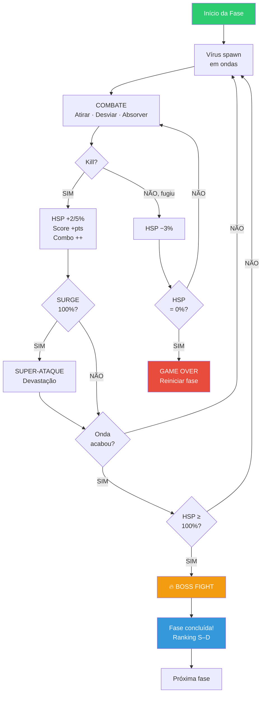
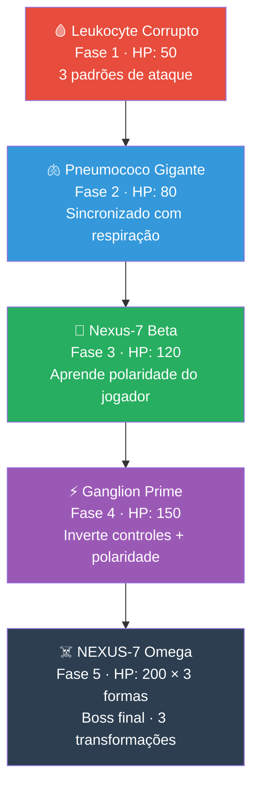
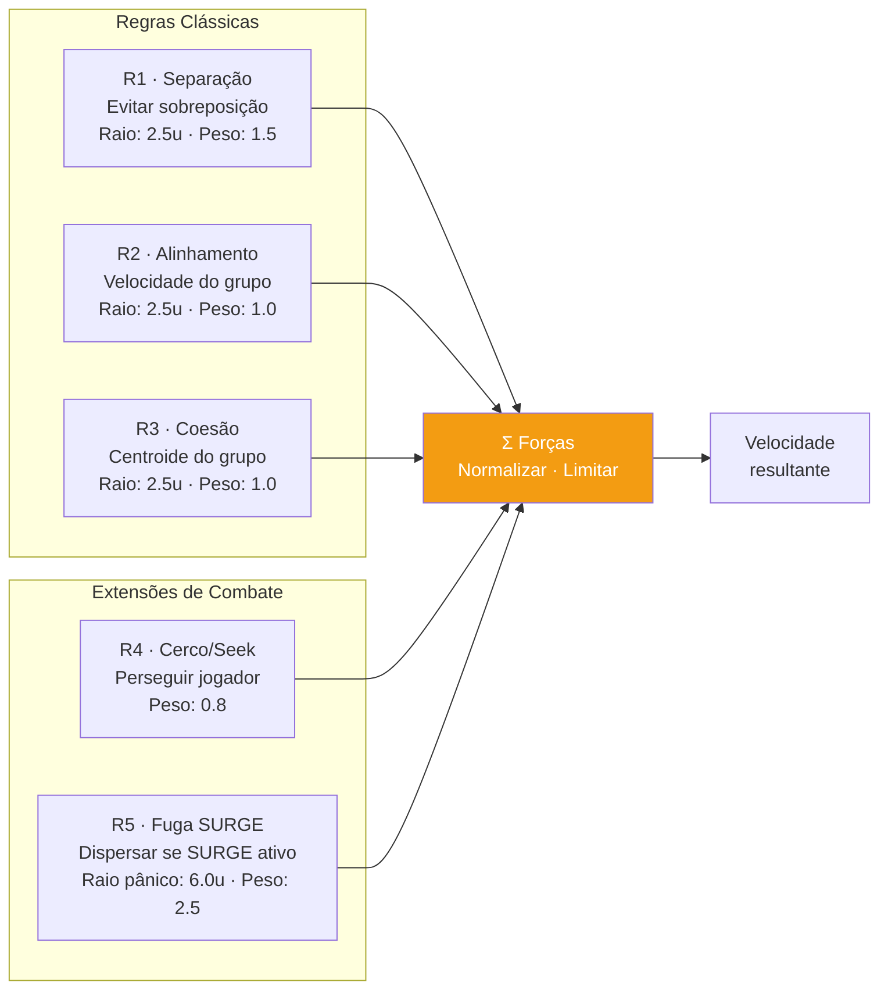
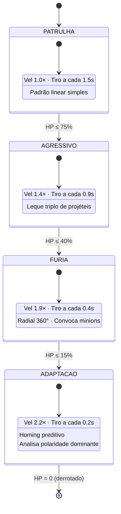
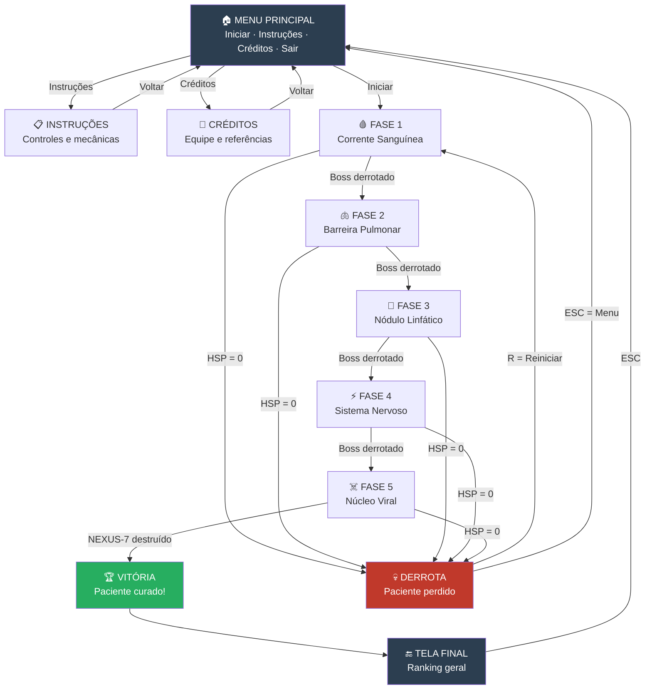
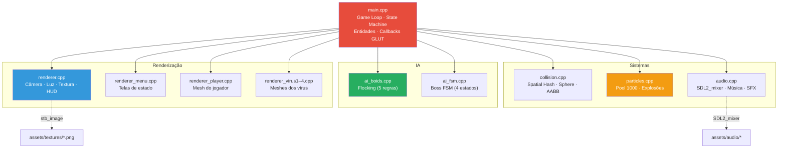
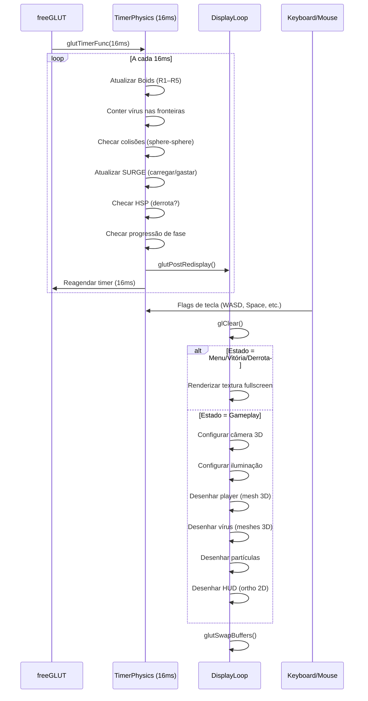
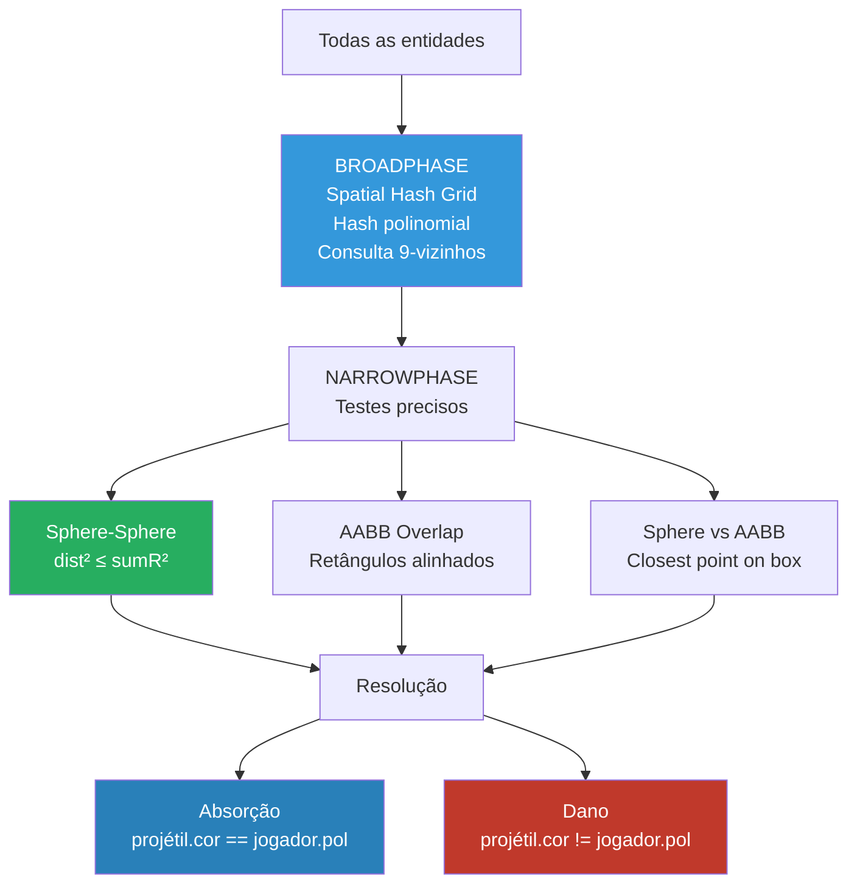

# 🦠 IMUNIDADE: A Guerra Celular — Game Design Document (GDD)

> **Documento de Design de Jogo — Versão 2.0**  
> Trabalho Final — Computação Gráfica (DC/CCN032 · 2026.1)  
> Universidade Federal do Piauí — Prof. Dr. Laurindo de Sousa Britto Neto  
> Última atualização: 19 de Junho de 2026

---

## 📖 Sumário

1. [Ficha Técnica](#1--ficha-técnica)
2. [Visão Geral](#2--visão-geral)
3. [Pilares de Design](#3--pilares-de-design)
4. [Narrativa e Ambientação](#4--narrativa-e-ambientação)
5. [Mecânicas de Jogo](#5--mecânicas-de-jogo)
6. [Controles e Mapeamento de Input](#6--controles-e-mapeamento-de-input)
7. [Fases e Progressão](#7--fases-e-progressão)
8. [Bestiário — Catálogo de Inimigos](#8--bestiário--catálogo-de-inimigos)
9. [Inteligência Artificial](#9--inteligência-artificial)
10. [Economia e Pontuação](#10--economia-e-pontuação)
11. [HUD e Interface do Usuário](#11--hud-e-interface-do-usuário)
12. [Fluxo de Telas (UX)](#12--fluxo-de-telas-ux)
13. [Direção de Arte e Estética Visual](#13--direção-de-arte-e-estética-visual)
14. [Design de Som e Música](#14--design-de-som-e-música)
15. [Arquitetura Técnica](#15--arquitetura-técnica)
16. [Recursos OpenGL Utilizados](#16--recursos-opengl-utilizados)
17. [Pipeline de Assets 3D](#17--pipeline-de-assets-3d)
18. [Detecção de Colisão](#18--detecção-de-colisão)
19. [Dependências e Compilação](#19--dependências-e-compilação)
20. [Balanceamento e Tabelas Numéricas](#20--balanceamento-e-tabelas-numéricas)
21. [Referências e Inspirações](#21--referências-e-inspirações)
22. [Equipe](#22--equipe)
23. [Glossário](#23--glossário)

---

## 1 · Ficha Técnica

| Campo | Detalhe |
|---|---|
| **Título** | Imunidade: A Guerra Celular |
| **Gênero** | Shoot 'em Up (Shmup) · Ação |
| **Perspectiva** | 3D com jogabilidade 2D (câmera perspectiva + gameplay planar) |
| **Plataformas** | Windows · Linux |
| **Motor / API** | OpenGL (Fixed-Function Pipeline) via freeGLUT |
| **Linguagem** | C++17 |
| **Áudio** | SDL2 + SDL2_mixer |
| **Resolução** | 1024 × 768 px (janela redimensionável) |
| **Framerate alvo** | 60 FPS (timer de 16ms) |
| **Público-alvo** | Jogadores de arcade/shmup, entusiastas de ciência |
| **Classificação estimada** | Livre (sem violência gráfica — metáfora biológica) |
| **Duração estimada** | 25–40 min (primeira jogada completa) |

---

## 2 · Visão Geral

**Imunidade: A Guerra Celular** é um *shoot 'em up* que se passa **dentro do corpo humano**. Em vez do espaço sideral clássico dos jogos que o inspiraram — Space Invaders, Galaga, Xenon II e Ikaruga — o campo de batalha são os sistemas biológicos de um paciente infectado por um vírus mutante.

O jogador controla o **NANOCELL-1**, um nanobô médico experimental de 800 nanômetros injetado diretamente na corrente sanguínea como último recurso terapêutico. O objetivo é eliminar os agentes patogênicos, manter a **Saúde do Paciente (HSP)** acima de zero e, ao final de 5 fases, destruir o núcleo do vírus NEXUS-7.

### Destaques do Projeto

| Característica | Descrição |
|---|---|
| **Mecânica central** | Sistema de polaridade cromática (Azul ↔ Vermelho), inspirado em *Ikaruga* |
| **IA** | Comportamento de enxame via algoritmo de Boids (Craig Reynolds, 1987) |
| **Progressão** | Medidor de Saúde do Paciente como gatilho de boss e medidor de risco |
| **Gráficos** | OpenGL 3D com jogabilidade 2D — Gouraud shading, texturas, blending, iluminação dinâmica |
| **Fases** | 5 ambientes biológicos distintos + 5 bosses temáticos com FSM |
| **Modelos** | Meshes 3D reais convertidas de Wavefront OBJ |

### Elevator Pitch

> *"Ikaruga encontra Fantastic Voyage — um shmup onde polaridade cromática decide se você absorve ou é destruído por cada projétil, enquanto enxames de vírus inteligentes coordenam ataques usando algoritmos de flocking."*

---

## 3 · Pilares de Design

Os três pilares que guiam todas as decisões de design deste projeto:



### 3.1 — Dualidade Tática
Toda interação no jogo passa pelo filtro da polaridade. O jogador nunca está "apenas atirando" — está constantemente decidindo qual cor manter, quando trocar, e se vale a pena absorver projéteis (arriscando levar dano da cor errada) para carregar o SURGE.

### 3.2 — Imersão Biológica
A temática não é cosmética. Cada fase simula um sistema real do corpo humano, e os inimigos são inspirados em patógenos reais. O vocabulário do jogo (anticorpos, linfócitos, mitocôndrias, sinapses) reforça a imersão educacional.

### 3.3 — IA Emergente
Os inimigos não seguem trilhos pré-definidos. O algoritmo de Boids gera movimentação orgânica, fluida e imprevisível. Combinado com a FSM dos bosses, o resultado é um jogo que se sente vivo a cada tentativa.

---

## 4 · Narrativa e Ambientação

### 4.1 — Premissa

O **Paciente Zero** — Dr. Rafael Menezes, um virologista de 34 anos da Universidade Federal do Piauí — foi infectado durante um acidente de laboratório por uma cepa sintética criada pelo grupo biohacker clandestino **Entropia Corp**: o vírus **NEXUS-7**.

O NEXUS-7 não é um patógeno comum. É uma entidade semi-consciente, uma bio-arma projetada para:
- **Aprender** — observa e cataloga as respostas imunológicas do hospedeiro;
- **Evoluir** — muta em tempo real para contornar anticorpos;
- **Coordenar** — seus agentes individuais operam como enxame com inteligência coletiva.

### 4.2 — O Protocolo Ícaro

Com o sistema imunológico em colapso total e todas as terapias convencionais falhando, a equipe médica ativa o **Protocolo Ícaro** — um procedimento experimental nunca testado em humanos: injetar o **NANOCELL-1**, um nanobô de combate de 800nm equipado com:

- Sistema de armas dual-polaridade (criocinético + térmico)
- Blindagem adaptativa que absorve energia hostil compatível
- Capacitor SURGE para ataques devastadores de área
- Propulsores de evasão com campo de invulnerabilidade temporária

O jogador assume o controle do NANOCELL-1 numa corrida contra o tempo — uma jornada microscópica através de 5 sistemas do corpo humano até o coração do vírus NEXUS-7.

### 4.3 — Arco Narrativo por Fase


| Fase | Arco Narrativo |
|---|---|
| **Fase 1 — Corrente Sanguínea** | Primeiro contato. NANOCELL-1 aprende o ambiente. Tutorial implícito. |
| **Fase 2 — Barreira Pulmonar** | O vírus invade os alvéolos. O cenário "respira" e o ritmo dita a batalha. |
| **Fase 3 — Nódulo Linfático** | Aliados e traidores. Linfócitos corrompidos enganam o jogador pela aparência. |
| **Fase 4 — Sistema Nervoso** | Sinapses invertem controles. Inimigos imitam o jogador com delay. Caos controlado. |
| **Fase 5 — Núcleo Viral** | Arena final. Destruir o NEXUS-7 Omega em suas 3 formas e curar o paciente. |

### 4.4 — Tom e Atmosfera

- **Escala:** Microscópica — o jogador é menor que uma hemácia.
- **Iluminação:** Bioluminescência dominante. Tons frios (azuis, verdes) contrastam com tons quentes (vermelhos, laranja) dos patógenos.
- **Sentimento:** Tensão crescente com momentos de alívio (power-ups). Sensação de "último recurso" — o jogador é a única esperança.

---

## 5 · Mecânicas de Jogo

### 5.1 — Sistema de Polaridade Cromática *(Mecânica Central)*

A mecânica mais importante do jogo, inspirada diretamente em **Ikaruga** (Treasure, 2001). O NANOCELL-1 opera em duas polaridades que alteram **ataque, defesa e vulnerabilidade** simultaneamente:

```
╔══════════════════════════════════════════╦═══════════════════════════════════════════╗
║  POLARIDADE AZUL (Criocinética)          ║  POLARIDADE VERMELHA (Térmica)            ║
╠══════════════════════════════════════════╬═══════════════════════════════════════════╣
║  ✔  Absorve projéteis AZUIS             ║  ✔  Absorve projéteis VERMELHOS           ║
║  ✔  Disparo: raio contínuo frio         ║  ✔  Disparo: pulso explosivo em área      ║
║  ✔  Aplica slow em inimigos atingidos   ║  ✔  Dano em área ao impacto               ║
║  ✘  Vulnerável a projéteis VERMELHOS    ║  ✘  Vulnerável a projéteis AZUIS          ║
╚══════════════════════════════════════════╩═══════════════════════════════════════════╝
```

**Regra crítica:** projéteis da cor correta são **absorvidos** (sem dano) e carregam o medidor SURGE. Projéteis da cor errada causam dano total ao nanobô.

**Implicação tática:** O jogador está constantemente num dilema — manter a polaridade que protege contra os projéteis mais numerosos, ou trocar para a polaridade que causa mais dano ao tipo de inimigo dominante?



### 5.2 — Ataque SURGE

O SURGE é o super-ataque do NANOCELL-1, carregado pela **absorção de projéteis** da mesma polaridade. Ao atingir 100%, o jogador pode liberar um ataque devastador:

| Tipo | Polaridade | Efeito | Duração |
|---|---|---|---|
| **Blizzard SURGE** | 🔵 Azul | Congela toda a tela com dano contínuo. Todos os inimigos ficam imóveis e sofrem DPS. | 3 segundos |
| **Inferno SURGE** | 🔴 Vermelho | Explosão radial massiva. Destrói todos os projéteis ativos na tela e causa dano em área. | Instantâneo |

**Comportamento da IA durante SURGE:** Quando o medidor SURGE do jogador atinge 100%, os Boids ativam a **Regra R5 (Fuga)** — o enxame dispersa preventivamente para reduzir o dano potencial em área. Isso cria uma janela de decisão interessante: usar o SURGE imediatamente (enquanto os inimigos ainda estão perto) ou esperar (correndo o risco de levar dano enquanto estão dispersos)?

### 5.3 — Medidor de Saúde do Paciente (HSP)

O HSP funciona como **medidor de progressão** da fase e **indicador de risco** simultâneo. Ele representa a saúde geral do paciente — não do nanobô.

| Evento | Variação HSP |
|---|---|
| Matar inimigo comum | **+2%** |
| Matar inimigo elite | **+5%** |
| Derrotar boss | **+15%** |
| Inimigo atravessa a tela sem ser eliminado | **−3%** |
| NANOCELL-1 recebe qualquer dano | **−1%** |

**Gatilhos de fase:**
- **HSP = 100%** → Boss da fase é liberado imediatamente (recompensa por eficiência).
- **HSP = 0%** → Game Over. O paciente não resistiu. A fase reinicia do início.

### 5.4 — Power-ups Orgânicos

Dropados aleatoriamente por inimigos ao morrer. Cada power-up é tematizado como um componente biológico real:

| Ícone | Power-up | Efeito | Duração |
|---|---|---|---|
| 💊 | **Anticorpo IgG** | +30% dano em todos os disparos | 10 segundos |
| 🧬 | **Fragmento de RNA** | +1 bomba de área (uso único, ativação manual) | Permanente |
| ⚡ | **Mitocôndria** | Velocidade de movimento +50% | 8 segundos |
| 🛡️ | **Linfócito T** | Escudo que absorve até 3 hits (qualquer cor) | Até esgotar |
| 🔄 | **Proteína Dual** | +20% velocidade de carregamento do SURGE | 15 segundos |
| ✨ | **Célula-Tronco** | Restaura 20% da vida máxima do nanobô | Instantâneo |

### 5.5 — Dash de Evasão

Pressionando `E`, o NANOCELL-1 executa um **dash rápido** na direção do movimento atual. Características:
- **Distância:** 3× a velocidade normal por 0.2 segundos
- **Cooldown:** 2 segundos
- **i-frames:** 12 frames de invencibilidade durante o dash (~200ms a 60fps)
- **Uso tático:** Atravessar cortinas de projéteis, esquivar de kamikazes, reposicionar rapidamente

### 5.6 — Loop de Gameplay



---

## 6 · Controles e Mapeamento de Input

### 6.1 — Mapeamento de Teclas

| Tecla | Ação | Contexto |
|---|---|---|
| `W` | Mover para cima | Gameplay |
| `A` | Mover para a esquerda | Gameplay |
| `S` | Mover para baixo | Gameplay |
| `D` | Mover para a direita | Gameplay |
| `SPACE` | Disparo contínuo (polaridade ativa) | Gameplay |
| `SHIFT` | Alternar polaridade (Azul ↔ Vermelho) | Gameplay |
| `Q` | Ativar SURGE (quando 100% carregado) | Gameplay |
| `E` | Dash de evasão (cooldown 2s) | Gameplay |
| `ESC` | Pausar / Sair para menu principal | Global |
| `F` | Alternar tela cheia (*fullscreen*) | Global |
| `R` | Reiniciar fase (após Game Over) | Game Over |
| `Mouse` | Navegar menus | Menu |

### 6.2 — Filosofia de Input

- **Mão esquerda:** Movimento (WASD) + habilidades (Q, E, Shift)
- **Mão direita:** Ataque (Space)
- Inspirado no layout padrão de FPS/action — familiar mesmo para jogadores casuais.
- Todas as ações de gameplay usam o teclado; o mouse é reservado exclusivamente para navegação de menus.

---

## 7 · Fases e Progressão

### Fase 1 — Corrente Sanguínea 🩸

| Aspecto | Detalhe |
|---|---|
| **Cenário** | Scroll horizontal com hemácias 3D flutuando como obstáculos decorativos. Plasma sanguíneo simulado por blending OpenGL (transparência vermelha em camadas). |
| **Paleta de cores** | Vermelhos profundos, rosas, brancos (plasma). |
| **Mecânica especial** | Correntes de plasma aumentam temporariamente a velocidade do nanobô em 30%. |
| **Inimigos** | Vírus Alfa (enxame azul), Bactéria Coco (linear vermelho). |
| **Boss** | *Leukocyte Corrupto* — leucócito infectado com 3 padrões de ataque cíclicos. |
| **Objetivo narrativo** | Tutorial implícito. O jogador aprende o sistema de polaridade sem instruções explícitas. |
| **Dificuldade** | ★☆☆☆☆ |

### Fase 2 — Barreira Pulmonar 🫁

| Aspecto | Detalhe |
|---|---|
| **Cenário** | Alvéolos que se expandem e contraem em ciclo de 4 segundos. Fundo com membrana alveolar translúcida (blending). |
| **Paleta de cores** | Rosas pálidos, brancos, azuis claros (oxigênio). |
| **Mecânica especial** | Alvéolo expandido = janela de vulnerabilidade do boss. Inimigos sincronizam aparições com o ritmo da "respiração". |
| **Inimigos** | Esporo Fúngico (kamikaze azul), Vírus Gama (camuflagem dual). |
| **Boss** | *Pneumococo Gigante* — ataca exclusivamente no ciclo de expiração. |
| **Dificuldade** | ★★☆☆☆ |

### Fase 3 — Nódulo Linfático 🧬

| Aspecto | Detalhe |
|---|---|
| **Cenário** | Interior de gânglio linfático com fluxo de linfa como corrente de fundo. Texturas orgânicas de tecido linfóide. |
| **Paleta de cores** | Verdes, amarelos, brancos (linfa). |
| **Mecânica especial** | Linfócitos T aliados circulam na tela e podem ser coletados como escudo. Linfócitos corrompidos imitam a aparência dos aliados — a distinção é feita pela cor (sutilmente diferente). |
| **Inimigos** | Microplaqueta Hive (boids dual), Príon Mimético (shadowplay). |
| **Boss** | *Nexus-7 Beta* — aprende a polaridade dominante usada pelo jogador e aumenta projéteis da cor oposta. |
| **Dificuldade** | ★★★☆☆ |

### Fase 4 — Sistema Nervoso Central ⚡

| Aspecto | Detalhe |
|---|---|
| **Cenário** | Axônios e sinapses. Pulsos elétricos (partículas brilhantes) atravessam a tela periodicamente. Fundo escuro com bioluminescência. |
| **Paleta de cores** | Roxos, azuis elétricos, brancos brilhantes. |
| **Mecânica especial** | Descarga sináptica **inverte os controles** do jogador por 3 segundos. Vírus Delta copia posição e disparo do nanobô com 2s de delay. |
| **Inimigos** | Vírus Delta (espelho), Príon Mimético (shadowplay com delay reduzido). |
| **Boss** | *Ganglion Prime* — ao entrar em *enrage*, inverte a polaridade do jogador forçosamente. |
| **Dificuldade** | ★★★★☆ |

### Fase 5 — Núcleo Viral (Boss Rush) ☠️

| Aspecto | Detalhe |
|---|---|
| **Cenário** | Interior do próprio NEXUS-7. Arena circular fechada, sem scroll. Paredes orgânicas pulsantes. |
| **Paleta de cores** | Pretos, vermelhos sangue, dourados (núcleo). |
| **Mecânica especial** | Sem entrada de novos inimigos comuns — toda a atenção vai ao boss. |
| **Inimigos** | Nenhum mob regular — exclusivamente o boss final. |
| **Boss Final** | *NEXUS-7 Omega* — 3 formas sequenciais (ver abaixo). |
| **Dificuldade** | ★★★★★ |

**NEXUS-7 Omega — 3 Formas Sequenciais:**

| Forma | Nome | Mecânica | Estratégia |
|---|---|---|---|
| **1ª** | Escudo Polar | Escudos coloridos protegem o núcleo. Cada escudo só é destruído por projéteis da cor correspondente. | Trocar polaridade para combinar com cada escudo. |
| **2ª** | Enxame Definitivo | Controla 40 vírus simultâneos via Boids. Cobertura total da arena. | Usar SURGE para limpar enxame. Sobrevivência pura. |
| **3ª** | Núcleo Exposto | HP baixo, bullet-hell intenso. Padrão denso de projéteis dual. | SURGE duplo para finalizar. Dash constante. |

### Sistema de Ranking por Fase

Ao final de cada fase é atribuído um ranking de **S** a **D** baseado em múltiplos critérios:

| Critério | Peso | Descrição |
|---|---|---|
| Total de kills | 25% | Inimigos eliminados vs. total que spawnaram |
| HSP final | 25% | Saúde do Paciente ao terminar a fase |
| Dano recebido | 20% | Total de hits sofridos pelo nanobô |
| Maior combo | 15% | Sequência máxima de kills sem dano |
| Tempo da fase | 15% | Velocidade de conclusão |

| Ranking | Pontuação | Recompensa |
|---|---|---|
| **S** | 90–100% | +50% DNA · Desbloqueia skin (se S em todas) |
| **A** | 75–89% | +25% DNA |
| **B** | 60–74% | +10% DNA |
| **C** | 40–59% | Sem bônus |
| **D** | < 40% | −10% DNA |

> **Recompensa secreta:** Ranking **S** em todas as 5 fases desbloqueia a skin **NEXUS-ZERO** para o NANOCELL-1 — uma versão estética baseada no design do vírus final.

---

## 8 · Bestiário — Catálogo de Inimigos

### 8.1 — Inimigos Comuns

| Nome | Polaridade | Padrão de IA | HP | Dano | Comportamento Detalhado |
|---|---|---|---|---|---|
| **Vírus Alfa** | 🔵 Azul | Enxame (Boids) | 2 | 1 | Opera em formação V via algoritmo de Boids. Mergulha coordenadamente em direção ao jogador. Foge quando SURGE está carregado. |
| **Bactéria Coco** | 🔴 Vermelho | Linear | 5 | 2 | Alta vida, movimento linear previsível. Dispara tiro duplo em intervalos regulares. Sem IA de flocking. |
| **Esporo Fúngico** | 🔵 Azul | Kamikaze | 1 | 3 | Detecta posição do jogador e acelera diretamente em sua direção. Explode ao contato causando dano em área pequena. |
| **Vírus Gama** | 🔵🔴 Dual | Camuflagem | 3 | 1 | Invisível quando imerso no plasma de fundo. Revela-se apenas ao disparar. Troca de cor quando atingido por projétil. |
| **Príon Mimético** | Oposta ao jogador | Shadowplay | 4 | 2 | Armazena 120 posições do jogador em buffer circular. Move-se com 2s de atraso, imitando o path do jogador. Dispara projéteis da cor oposta. |
| **Vírus Delta** | 🔴 Vermelho | Espelho | 3 | 2 | Copia posição e disparo do jogador simultaneamente, como um "reflexo". Aprende padrões de evasão. |
| **Microplaqueta Hive** | 🔵🔴 Ambos | Boids Avançado | 2 | 1 | Metade do enxame é azul, metade vermelha. Exige troca de polaridade constante para absorver projéteis de ambos os grupos. |

### 8.2 — Bosses



---

## 9 · Inteligência Artificial

### 9.1 — Algoritmo de Boids (Craig Reynolds, 1987)

Os vírus menores operam via 3 regras base + 2 extensões combativas, produzindo movimentação orgânica e imprevisível:



**Detalhamento das regras:**

| Regra | Descrição Técnica | Raio | Peso |
|---|---|---|---|
| **R1 — Separação** | Vetor repulsão inverso-quadrático para cada vizinho dentro do raio. Normalizado para evitar sobreposição. | 2.5u | 1.5 |
| **R2 — Alinhamento** | Calcula média de velocidade dos vizinhos no raio. Aplica steering para convergir. Produz movimento fluido. | 2.5u | 1.0 |
| **R3 — Coesão** | Calcula centroide dos vizinhos no raio. Aplica steering para se aproximar. Mantém enxame coeso. | 2.5u | 1.0 |
| **R4 — Cerco (Seek)** | Quando detecta NANOCELL-1, calcula velocidade desejada em direção ao jogador. Limitada por `maxForca`. | ∞ | 0.8 |
| **R5 — Fuga SURGE (Flee)** | Quando SURGE ≥ 100%, inverte para fuga. Raio de pânico de 6.0u com boost de 1.5× na velocidade máxima. | 6.0u | 2.5 |

**Integração numérica:** Euler explícito com velocity clamping para estabilidade.  
**Complexidade:** O(n²) para n boids — aceitável para o tamanho atual do enxame (20 boids/fase).

### 9.2 — Máquina de Estados Finitos dos Bosses (FSM)

Cada boss opera via uma FSM de 4 estados com transições baseadas em vida:



### 9.3 — IA dos Príons Miméticos (Buffer Circular)

Utiliza **buffer circular** de posições para criar um "fantasma" do jogador:

1. Armazena as últimas **120 posições** `(x, y)` do NANOCELL-1 (equivalente a 2s a 60fps).
2. Move-se exatamente para a posição `buffer[t − 2s]` a cada frame — reproduzindo o path passado do jogador.
3. Dispara projéteis com **cor oposta** mirando a posição **atual** do jogador (predição simples).
4. O delay diminui conforme a vida do Príon cai: **2s → 1.5s → 1s → 0.5s** (fica progressivamente mais assustador).

---

## 10 · Economia e Pontuação

### 10.1 — Multiplicadores de Combo

| Multiplicador | Condição de Ativação |
|---|---|
| **×1** (base) | Qualquer kill sem combo ativo |
| **×2** | 5 kills consecutivos sem receber dano |
| **×3** | 10 kills + troca de polaridade com absorção ativa |
| **×5** | Kill realizado durante SURGE ativo |
| **×10** | Boss derrotado sem tomar nenhum dano na fase inteira (*Perfect Clear*) |

O combo é **resetado** ao receber qualquer dano. Isso incentiva gameplay defensivo e agressivo simultaneamente — o jogador quer maximizar kills, mas não pode ser descuidado.

### 10.2 — Moeda: Fragmentos de DNA

Dropados por inimigos ao morrer. Acumulados entre fases e gastos na **Árvore de Upgrades**:

```
                            ┌─────────────────┐
                            │  ÁRVORE DE       │
                            │  UPGRADES        │
                            └────────┬────────┘
                 ┌───────────────────┼───────────────────┐
          ┌──────┴──────┐    ┌───────┴──────┐    ┌───────┴───────┐
          │  ⚔️ ATAQUE   │    │  🔄 ABSORÇÃO  │    │  💨 MOBILIDADE │
          ├─────────────┤    ├──────────────┤    ├───────────────┤
          │ Dano base   │    │ SURGE +rápido│    │ Velocidade +  │
          │ Cadência +  │    │ Raio absorção│    │ Dash +rápido  │
          │ Proj. maior │    │ Eficiência + │    │ Cooldown −    │
          └─────────────┘    └──────────────┘    └───────────────┘
```

Cada upgrade tem **3 níveis**, com custo crescente em DNA:

| Nível | Custo DNA | Bônus |
|---|---|---|
| 1 | 50 | +15% |
| 2 | 150 | +30% |
| 3 | 400 | +50% |

---

## 11 · HUD e Interface do Usuário

### 11.1 — Layout do HUD

```
┌──────────────────────────────────────────────────────────────────┐
│                                                                  │
│  NANOCELL-1 ❤️❤️❤️                FASE 3 — NÓDULO LINFÁTICO     │
│  VIDA   ███████░░  78%            HSP   ██████░░░  62%           │
│                                                                  │
│  ● POLARIDADE: AZUL               SURGE ████░░░░  47%           │
│                                                                  │
│                                                                  │
│                     [ ÁREA DE GAMEPLAY ]                          │
│                                                                  │
│                                                                  │
│  SCORE: 48.200    COMBO: ×3    DNA: ◈ 120    DASH: ●●○ (1.2s)   │
│                                                                  │
└──────────────────────────────────────────────────────────────────┘
```

### 11.2 — Elementos do HUD

| Elemento | Posição | Comportamento Visual |
|---|---|---|
| **Vida do nanobô** | Topo esquerdo | 3 corações máximo. Piscam em vermelho ao perder. |
| **HSP** | Topo direito | Barra colorida: 🟢 > 50%, 🟡 25–50%, 🔴 < 25%. |
| **Indicador de polaridade** | Centro esquerdo | Círculo com brilho pulsante (azul ou vermelho). |
| **Medidor SURGE** | Centro direito | Barra crescente. **Pisca intensamente** ao atingir 100%. |
| **Score** | Rodapé esquerdo | Numérico com separador de milhar. |
| **Combo** | Rodapé centro | Multiplicador ativo. Cresce em tamanho com combos maiores. |
| **DNA coletado** | Rodapé direito | Ícone ◈ + quantidade. |
| **Dash cooldown** | Rodapé extremo | Indicador circular de recarga. |

### 11.3 — Feedback Visual

| Evento | Feedback |
|---|---|
| Absorção de projétil | Flash breve na cor da polaridade + partículas de absorção |
| Dano recebido | Tela pisca vermelho (overlay alpha) + screen shake leve |
| Troca de polaridade | Onda circular se expande do nanobô na nova cor |
| SURGE ativado | Tela inteira recebe overlay da cor + explosão de partículas |
| Kill de inimigo | Explosão de partículas na cor do inimigo + texto "+pts" flutuante |
| Game Over | Fade to red + texto "PACIENTE PERDIDO" |

---

## 12 · Fluxo de Telas (UX)



### Estados internos do jogo (`enum TelaEstado`)

| ID | Estado | Descrição |
|---|---|---|
| 0 | `TELA_MENU` | Menu principal com 4 botões clicáveis |
| 1 | `FASE_1_SANGUE` | Gameplay — Corrente Sanguínea |
| 2 | `FASE_2_PULMAO` | Gameplay — Barreira Pulmonar |
| 3 | `FASE_3_LINFATICO` | Gameplay — Nódulo Linfático |
| 4 | `FASE_4_NERVOSO` | Gameplay — Sistema Nervoso |
| 5 | `FASE_5_NUCLEO_VIRAL` | Gameplay — Núcleo Viral |
| 6 | `TELA_VITORIA` | Tela de vitória (textura fullscreen) |
| 7 | `TELA_DERROTA` | Tela de derrota (textura fullscreen) |
| 8 | `TELA_CREDITOS` | Créditos (textura fullscreen) |
| 9 | `TELA_FIM` | Tela final / ranking geral |
| 10 | `TELA_INSTRUCOES` | Tela de instruções (textura fullscreen) |

---

## 13 · Direção de Arte e Estética Visual

### 13.1 — Filosofia Visual

O jogo busca um equilíbrio entre **realismo biológico estilizado** e **legibilidade de gameplay**. Os cenários evocam imagens de microscópio eletrônico, mas com cores saturadas e iluminação dramática para garantir que o jogador sempre consiga distinguir elementos importantes.

### 13.2 — Paleta Cromática por Fase

| Fase | Cor Dominante | Cor Secundária | Cor de Acento |
|---|---|---|---|
| 1 — Sangue | Vermelho escuro `#8B0000` | Rosa `#FF6B6B` | Branco plasma |
| 2 — Pulmão | Azul claro `#87CEEB` | Rosa pálido `#FFB6C1` | Branco oxigênio |
| 3 — Linfa | Verde `#2ECC71` | Amarelo `#F1C40F` | Branco linfa |
| 4 — Nervos | Roxo `#8E44AD` | Azul elétrico `#3498DB` | Branco sinapse |
| 5 — Núcleo | Preto `#1A1A2E` | Vermelho sangue `#E74C3C` | Dourado `#F39C12` |

### 13.3 — Design dos Modelos 3D

Os modelos são criados em software de modelagem 3D, exportados como Wavefront OBJ, e convertidos para arrays C++ via pipeline automatizada (ver seção 17):

| Entidade | Estilo | Polycount Aprox. |
|---|---|---|
| **NANOCELL-1** | Cápsula tecnológica com detalhes mecânicos | ~8.000 triângulos |
| **Vírus 1–4** | Esferas espinhosas, cápsulas bacterianas | ~3.000–6.500 triângulos |
| **Bosses** | Versões maiores e mais detalhadas dos vírus | Planejado |

### 13.4 — Efeitos Visuais

| Efeito | Técnica | Uso |
|---|---|---|
| **Explosões** | Sistema de partículas (até 1000, pool estático) | Morte de inimigos |
| **Plasma/linfa** | Blending `GL_SRC_ALPHA` em quads texturizados | Cenários |
| **Brilho de polaridade** | `glColor` com cores vibrantes + material emissivo | NANOCELL-1 |
| **Gouraud shading** | `GL_SMOOTH` + normais por vértice + `GL_LIGHT0` | Superfícies orgânicas |
| **Profundidade** | Objetos decorativos em Z negativo, gameplay em Z=0 | Parallax |

---

## 14 · Design de Som e Música

### 14.1 — Filosofia Sonora

O áudio reforça a ambientação microscópica: sons abafados, reverberados, como se ouvidos debaixo d'água. A música é eletrônica com elementos orgânicos (pulsações, batimentos).

### 14.2 — Trilha Sonora

| Contexto | Estilo | Loop |
|---|---|---|
| Menu principal | Ambient eletrônico, lento, misterioso | Sim |
| Fases 1–4 | Eletrônico progressivo, intensidade crescente | Sim, por fase |
| Boss fight | Percussivo intenso, sintetizadores agressivos | Sim |
| Fase 5 (final) | Épico orquestral + eletrônico | Sim |
| Vitória | Fanfarra sintética + sons de cura | Não |
| Derrota | Fade-out com batimento cardíaco desacelerando | Não |

### 14.3 — Efeitos Sonoros (SFX)

| Efeito | Trigger |
|---|---|
| Disparo laser (polaridade) | Cada tiro do jogador |
| Explosão de vírus | Kill de inimigo |
| SURGE ativação | Pressionar Q com 100% |
| Absorção de projétil | Projétil da mesma cor atinge jogador |
| Dano recebido | Projétil de cor errada atinge jogador |
| Troca de polaridade | Pressionar Shift |
| Power-up coletado | Contato com item |
| Dash | Pressionar E |

### 14.4 — Implementação Técnica

- **Biblioteca:** SDL2 + SDL2_mixer
- **Formato de música:** OGG Vorbis (streaming, sem carregamento total em memória)
- **Formato de SFX:** WAV (baixa latência, carregados como chunks)
- **Canais:** Mixer configurado para stereo, 44100Hz, buffer 2048
- **Gerenciamento:** Classe `AudioManager` com inicialização, playback e cleanup

---

## 15 · Arquitetura Técnica

### 15.1 — Estrutura de Diretórios

```
imunidade/
├── src/
│   ├── main.cpp                   # Loop GLUT, game state, callbacks, entidades
│   ├── classes/
│   │   ├── renderer.cpp           # Pipeline OpenGL: câmera, luz, textura, HUD
│   │   ├── renderer_menu.cpp      # Telas de estado (menu, vitória, derrota)
│   │   ├── renderer_player.cpp    # Mesh 3D do NANOCELL-1 (gerada)
│   │   ├── renderer_virus1.cpp    # Mesh 3D vírus tipo 1 (gerada)
│   │   ├── renderer_virus2.cpp    # Mesh 3D vírus tipo 2 (gerada)
│   │   ├── renderer_virus3.cpp    # Mesh 3D vírus tipo 3 (gerada)
│   │   ├── renderer_virus4.cpp    # Mesh 3D vírus tipo 4 (gerada)
│   │   ├── collision.cpp          # Spatial hash + sphere/AABB detection
│   │   ├── ai_boids.cpp           # Flocking AI (5 regras de Reynolds)
│   │   ├── ai_fsm.cpp             # FSM dos bosses (4 estados)
│   │   ├── particles.cpp          # Sistema de partículas (pool de 1000)
│   │   └── audio.cpp              # SDL2_mixer wrapper
│   └── bibliotecas/               # Headers do projeto + stb_image.h
│       ├── renderer.h
│       ├── ai_boids.h
│       ├── ai_fsm.h
│       ├── collision.h
│       ├── particles.h
│       ├── audio.h
│       └── stb_image.h            # Terceiro: carregamento de PNG (header-only)
├── assets/
│   └── textures/                  # PNG: telas de menu, instruções, créditos, etc.
├── docs/
│   └── GDD.md                     # Este documento
├── conveter.py                    # Pipeline OBJ → C++ (ver seção 17)
├── Makefile                       # Build cross-platform (Linux + Windows)
├── run.bat                        # Script de execução Windows
└── README.md
```

### 15.2 — Diagrama de Módulos



### 15.3 — Game Loop (60 FPS)



---

## 16 · Recursos OpenGL Utilizados

Tabela detalhada de todos os recursos da API OpenGL empregados no projeto:

| Recurso | Função OpenGL | Aplicação no Jogo |
|---|---|---|
| **Texturas 2D** | `glBindTexture`, `glTexImage2D`, `GL_TEXTURE_2D` | Sprites de menus, fundos de fase, HUD |
| **Gouraud Shading** | `GL_SMOOTH` + normais por vértice | Interpolação suave de cor em superfícies (esfera decorativa) |
| **Blending / Transparência** | `GL_BLEND`, `GL_SRC_ALPHA`, `GL_ONE_MINUS_SRC_ALPHA` | Transparência do plasma, telas de menu |
| **Depth Buffer** | `GL_DEPTH_TEST` | Ordenação de profundidade: fundo 3D (Z−) e gameplay (Z=0) |
| **Iluminação** | `GL_LIGHTING`, `GL_LIGHT0` | Luz ambiente global + ponto de luz direcional |
| **Materiais** | `glMaterialfv` (ambient, diffuse, specular, shininess) | Propriedades de superfície do player e vírus |
| **Color Material** | `GL_COLOR_MATERIAL` | Cores de vértice controlam material automaticamente |
| **Normalização** | `GL_NORMALIZE` | Correção de normais após transformações de escala |
| **Projeção Perspectiva** | `gluPerspective(45°, ratio, 0.1, 100)` | Câmera 3D para cenário e modelos |
| **Projeção Ortográfica** | `gluOrtho2D` | HUD (texto, barras) e telas de menu |
| **Câmera** | `gluLookAt(0,0,15, 0,0,0, 0,1,0)` | Posicionamento da câmera |
| **Primitivas** | `GL_TRIANGLES`, `GL_QUAD_STRIP`, `GL_QUADS`, `GL_POINTS` | Modelos 3D, esfera Gouraud, menus, partículas |
| **Matrix Stack** | `glPushMatrix`, `glPopMatrix` | Isolamento de transformações por entidade |
| **Transformações** | `glTranslatef`, `glRotatef`, `glScalef` | Posicionamento e animação de entidades |
| **Bitmap Text** | `glutBitmapCharacter(GLUT_BITMAP_HELVETICA_18)` | Texto do HUD (score, vida, HSP) |
| **Double Buffering** | `GLUT_DOUBLE`, `glutSwapBuffers` | Renderização sem flicker |
| **Sistema de partículas** | `GL_POINTS` + `glColor4f` (CPU-side) | Explosões, trails, efeitos visuais |

---

## 17 · Pipeline de Assets 3D

### 17.1 — Fluxo de Conversão


### 17.2 — Script `conveter.py`

O script Python lê arquivos Wavefront `.obj`, processa vértices e faces, aplica fan-triangulação para polígonos com mais de 3 vértices, e gera funções C++ completas:

**Input:** Arquivo `.obj` com vértices (`v x y z`) e faces (`f v1/vt1/vn1 ...`)  
**Output:** Função C++ com `glBegin(GL_TRIANGLES)` e chamadas `glVertex3f` para cada triângulo, com fator de escala `s` (parâmetro `tamanho`)

**Modelos gerados:**

| Arquivo Gerado | Modelo OBJ Original | Linhas | Função |
|---|---|---|---|
| `renderer_player.cpp` | `atirador.obj` | 24.764 | `DesenharLeukocito(float tamanho)` |
| `renderer_virus1.cpp` | vírus tipo 1 | 9.224 | `DesenharVirus1(float tamanho)` |
| `renderer_virus2.cpp` | vírus tipo 2 | 10.790 | `DesenharVirus2(float tamanho)` |
| `renderer_virus3.cpp` | vírus tipo 3 | 19.593 | `DesenharVirus3(float tamanho)` |
| `renderer_virus4.cpp` | vírus tipo 4 | 19.359 | `DesenharVirus4(float tamanho)` |

---

## 18 · Detecção de Colisão

### 18.1 — Arquitetura em Duas Fases



### 18.2 — Spatial Hash Grid

Implementação de grade espacial para otimização broadphase:
- **Estrutura:** `unordered_map<int, vector<ColisaoObjeto>>`
- **Hash:** Polinomial — `ix * 73856093 ^ iy * 19349663`
- **Consulta:** 9 células vizinhas (célula atual + 8 adjacentes)
- **Complexidade:** Reduz de O(n²) para ~O(n) em cenários com distribuição uniforme

### 18.3 — Tipos de Hitbox

| Entidade | Tipo de Colisão | Parâmetros |
|---|---|---|
| NANOCELL-1 | Esfera | Raio configurável |
| Vírus comuns | Esfera | Raio por tipo |
| Projéteis | AABB | Largura × Altura |
| Bosses | Múltiplas esferas | Por segmento corporal |
| Power-ups | Esfera | Raio fixo |

### 18.4 — Lógica de Polaridade na Colisão

```
SE projétil.cor == jogador.polaridade ENTÃO
    → ABSORÇÃO: medidor SURGE += incremento
    → Sem dano ao jogador
    → Feedback visual de absorção (partículas + flash)
SENÃO
    → DANO: vida do jogador −= projétil.dano
    → HSP −= 1%
    → Feedback visual de dano (screen flash vermelho)
FIM SE
```

---

## 19 · Dependências e Compilação

### 19.1 — Bibliotecas Necessárias

| Biblioteca | Versão Mín. | Uso | Instalação (Ubuntu/Debian) |
|---|---|---|---|
| **freeGLUT** | 3.0+ | Janela, callbacks OpenGL, primitivas | `sudo apt install freeglut3-dev` |
| **OpenGL + GLU** | 2.1+ | API gráfica principal | Incluso no driver GPU |
| **SDL2** | 2.0+ | Subsistema de áudio | `sudo apt install libsdl2-dev` |
| **SDL2_mixer** | 2.0+ | Música (OGG) + SFX (WAV) | `sudo apt install libsdl2-mixer-dev` |
| **stb_image** | — | Carregamento de texturas PNG | Incluso (header-only) |

### 19.2 — Compilação

#### Linux
```bash
# Instalar dependências
sudo apt update
sudo apt install freeglut3-dev libsdl2-dev libsdl2-mixer-dev

# Compilar
make

# Executar
./imunidade_jogo
```

#### Windows (MinGW)
```batch
REM Compilar
make

REM Executar
imunidade_jogo.exe

REM Ou usar o script
run.bat
```

### 19.3 — Makefile

```makefile
CXX      = g++
CXXFLAGS = -std=c++17 -Wall -Wextra -O0 -I./src/bibliotecas -I./src

# Detecção automática de plataforma
ifeq ($(OS),Windows_NT)
    LIBS   = -lmingw32 -lfreeglut -lopengl32 -lglu32 -lSDL2main -lSDL2 -lSDL2_mixer -mconsole
    TARGET = imunidade_jogo.exe
else
    LIBS   = -lglut -lGL -lGLU -lSDL2 -lSDL2_mixer
    TARGET = imunidade_jogo
endif

SRC = src/main.cpp \
      src/classes/renderer.cpp \
      src/classes/renderer_menu.cpp \
      src/classes/renderer_player.cpp \
      src/classes/renderer_virus1.cpp \
      src/classes/renderer_virus2.cpp \
      src/classes/renderer_virus3.cpp \
      src/classes/renderer_virus4.cpp \
      src/classes/collision.cpp \
      src/classes/ai_boids.cpp \
      src/classes/ai_fsm.cpp \
      src/classes/particles.cpp \
      src/classes/audio.cpp

OBJ = $(SRC:.cpp=.o)

all: $(TARGET)

$(TARGET): $(OBJ)
	$(CXX) $(CXXFLAGS) $(OBJ) -o $(TARGET) $(LIBS)
```

---

## 20 · Balanceamento e Tabelas Numéricas

### 20.1 — Atributos do Jogador

| Atributo | Valor Base | Upgrade Máx. |
|---|---|---|
| Vida (HP) | 3 corações | — |
| Velocidade de movimento | 0.25 u/frame | 0.375 u/frame (+50%) |
| Dano por disparo | 1 | 1.5 (+50%) |
| Cadência de disparo | 1 tiro / 0.15s | 1 tiro / 0.10s |
| Carregamento SURGE | +0.1 / tick (absorção) | +0.15 / tick |
| Consumo SURGE | −0.8 / tick (ativo) | — |
| Dash cooldown | 2.0 s | 1.0 s |
| Dash i-frames | 12 frames (~200ms) | — |

### 20.2 — Atributos dos Inimigos por Fase

| Fase | Qtd. Vírus Spawn | HP Médio | Dano | Velocidade | Vírus por Frame (Boids) |
|---|---|---|---|---|---|
| 1 — Sangue | 20 | 2 | 1 | 1.0× | 20 |
| 2 — Pulmão | 25 | 3 | 1.5 | 1.2× | 25 |
| 3 — Linfa | 30 | 3 | 2 | 1.3× | 30 |
| 4 — Nervos | 35 | 4 | 2 | 1.5× | 35 |
| 5 — Núcleo | 0 (boss only) | — | — | — | 40 (forma 2 do boss) |

### 20.3 — Curva de Dificuldade

```
Dificuldade
    ▲
    │                                          ╱── Fase 5: Boss Rush
    │                                    ╱────╱
    │                              ╱────╱
    │                        ╱────╱ ← Inversão de controles (F4)
    │                  ╱────╱
    │            ╱────╱ ← Linfócitos traidores (F3)
    │      ╱────╱
    │ ────╱ ← Tutorial implícito (F1–F2)
    │╱
    └──────────────────────────────────────────► Tempo
         F1      F2      F3      F4      F5
```

---

## 21 · Referências e Inspirações

### 21.1 — Jogos

| Jogo | Ano | Studio | Influência no Projeto |
|---|---|---|---|
| **Space Invaders** | 1978 | Taito | Estrutura base de shmup, formações de inimigos em grid |
| **Galaxian** | 1979 | Namco | Inimigos com ataques individuais em mergulho |
| **Galaga** | 1981 | Namco | Padrões de entrada em formação, sistema de power-ups |
| **Xenon II: Megablast** | 1989 | Bitmap Brothers | Scroll vertical, variedade de inimigos orgânicos/biológicos |
| **Deluxe Galaga** | 1994 | Edgar M. Vigdal | Sistema de multiplicadores de score e bonus stages |
| **Ikaruga** | 2001 | Treasure | **Sistema de polaridade cromática — inspiração direta principal** |

### 21.2 — Referências Acadêmicas

| Autor | Obra | Ano | Aplicação |
|---|---|---|---|
| Reynolds, C. W. | *Flocks, herds and schools: A distributed behavioral model.* ACM SIGGRAPH | 1987 | Algoritmo de Boids para IA de enxame |
| Foley, J. et al. | *Computer Graphics: Principles and Practice.* Addison-Wesley | 1990 | Fundamentos de pipeline gráfico |
| Akenine-Möller, T. et al. | *Real-Time Rendering.* 4ª ed. CRC Press | 2018 | Técnicas de renderização em tempo real |

### 21.3 — Bibliotecas e Ferramentas

| Biblioteca | Autor / Org. | Licença | Uso no Projeto |
|---|---|---|---|
| [freeGLUT](http://freeglut.sourceforge.net/) | Pawel W. Olszta et al. | MIT | Janela, input, callbacks OpenGL |
| [SDL2_mixer](https://www.libsdl.org/projects/SDL_mixer/) | Sam Lantinga et al. | zlib | Áudio: música OGG + SFX WAV |
| [stb_image](https://github.com/nothings/stb) | Sean Barrett | Public Domain | Carregamento de texturas PNG |

### 21.4 — Referências Visuais e Científicas

| Tema | Referência | Uso |
|---|---|---|
| Anatomia celular | *Gray's Anatomy* (41ª ed.) | Design de cenários biológicos |
| Microbiologia | *Microbiology: An Introduction* (Tortora et al.) | Design de inimigos patogênicos |
| Nanotecnologia médica | *Nanomedicine* (Freitas, R.) | Conceito do NANOCELL-1 |
| Microscopia eletrônica | Banco de imagens NIH/NIAID | Paletas de cores e texturas |

---

## 22 · Equipe

| Membro | Função |
|---|---|
| [Seu Nome] | Design, programação e arte |

**Disciplina:** Computação Gráfica (DC/CCN032)  
**Período:** 2026.1  
**Instituição:** Universidade Federal do Piauí (UFPI)  
**Professor:** Prof. Dr. Laurindo de Sousa Britto Neto

---

## 23 · Glossário

| Termo | Definição |
|---|---|
| **Boids** | Algoritmo de comportamento de grupo (Craig Reynolds, 1987). Simula flocking via 3 regras: separação, alinhamento e coesão. |
| **Bullet-hell** | Subgênero de shmup onde a tela é preenchida com centenas de projéteis. Exige memorização e reflexos. |
| **FSM** | Finite State Machine (Máquina de Estados Finitos). Modelo de IA onde um agente transiciona entre estados discretos. |
| **Gouraud Shading** | Técnica de sombreamento que interpola cores linearmente entre os vértices de um polígono. |
| **HSP** | Health of the Subject/Patient. Medidor que representa a saúde do paciente (não do jogador). |
| **HUD** | Heads-Up Display. Interface gráfica sobreposta ao gameplay. |
| **i-frames** | Invincibility frames. Período de invulnerabilidade temporária durante certas ações. |
| **NANOCELL-1** | O nanobô controlado pelo jogador. Protagonista do jogo. |
| **NEXUS-7** | O vírus antagonista principal. Bio-arma semi-consciente. |
| **Polaridade** | Sistema dual (Azul/Vermelho) que define ataque, defesa e vulnerabilidade do jogador. |
| **Shmup** | Shoot 'em up. Gênero de jogo de ação com foco em disparos e evasão. |
| **Spatial Hash** | Estrutura de dados que divide o espaço em células para otimizar consultas de proximidade. |
| **SURGE** | Super-ataque carregável do NANOCELL-1. Requer absorção de projéteis para carregar. |

---

> *"No universo microscópico, até a menor célula pode mudar o destino de um paciente."*

---

**Fim do Game Design Document — v2.0**  
**Imunidade: A Guerra Celular © 2026**
